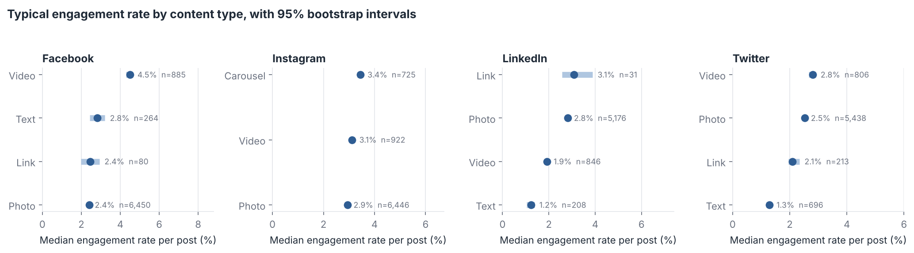
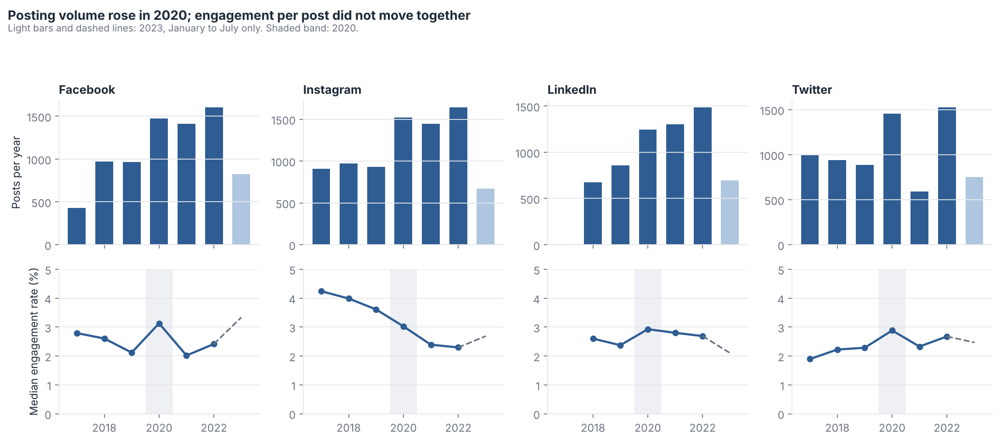
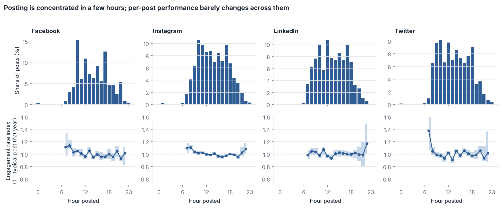
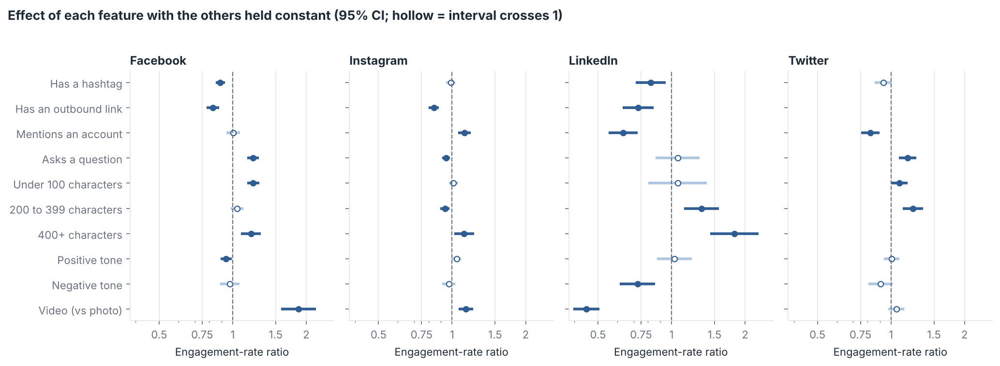

# Stanbic IBTC social media: what actually drives engagement?

An analysis of 29,186 posts with performance data from Stanbic IBTC Nigeria's Facebook, Instagram, LinkedIn and Twitter accounts, January 2017 to July 2023. The data was provided by Play House Communication for a hackathon.

This is version 2 of the project. Version 1 reached conclusions from summed totals and repaired data errors by guessing. This version rebuilds the analysis so that every comparison is per post, every exclusion is logged, and every claim carries a confidence interval or an effect size. [CHANGES.md](CHANGES.md) lists what changed and why.

## Key findings

**1. Volume is not performance.** Photos collected most engagements in total because they were 76% to 84% of everything posted. Per post, the best format depends on the platform. Facebook videos earn a typical engagement rate of 4.5% against 2.4% for photos, although they reach far fewer people. On LinkedIn the order reverses, and on Instagram format matters little.



**2. The 2020 "surge" was mostly more posting.** Posting volume rose 46% to 65% in 2020 on every platform. Per post, 2020 was better on three platforms and worse on Instagram, where engagement has declined steadily since 2017. The data cannot attribute 2020 to COVID-19. Reach per post has fallen by about half or more since its 2019 or 2020 peak on every platform, even as the team posted more.



**3. There is no magic posting hour.** 10am was the busiest hour, and 10am posts perform like a typical post. Early-morning posts (7am to 8am) do somewhat better on three platforms, but few posts went out then. That makes it worth testing, not a rule.



**4. Hashtags do not lift engagement and links reduce it.** With content type, year, time, length and tone held constant, hashtags are neutral or associated with lower engagement (11% lower on Facebook, 18% on LinkedIn). Outbound links are associated with 16% to 27% lower engagement on Facebook, Instagram and LinkedIn. Questions help on Facebook and Twitter. Long posts help on LinkedIn.



**5. Post wording is a weak lever.** Tested on posts from 2022 to 2023 that the models never saw, post features explain about 10% of the variation in engagement rate on Facebook and essentially none elsewhere. Where there is signal, it comes from video versus photo, not character count.

## What this means for a content team

* Judge formats per post and per platform, not by totals or with one rule for all platforms.
* Treat campaign hashtags as campaign tracking, not as an engagement tactic.
* Test moving links out of the post body (for example, into the first comment) on Facebook, Instagram and LinkedIn.
* Test early-morning scheduling before changing the posting calendar.
* Before posting more, test whether volume is diluting reach per post.

## Method in brief

| Step | Approach |
|---|---|
| Cleaning | Six logged exclusion rules (`src/clean.py`). Missing metrics stay missing. Impossible values (negative engagements, engagements above impressions) are excluded, not repaired. 3,978 Facebook dates in a second format are recovered. |
| Unit of analysis | The post. Engagement rate is recomputed as engagements divided by impressions. |
| Comparisons | Medians with 95% bootstrap intervals. Kruskal-Wallis with epsilon squared for group differences. Spearman correlation. |
| Drift control | A year-adjusted index (a post's rate divided by its platform's median that year) for hour and hashtag comparisons. |
| Controlled effects | One Poisson regression per platform with log(impressions) as offset and robust standard errors. Coefficients are engagement-rate ratios. |
| Tone | VADER sentiment on the bank's own posts, spot-checked for face validity. |
| Prediction | Random forest trained on 2017 to 2021, tested on 2022 to 2023, with permutation importance on the test set and a median baseline. |

## Limitations

* Observational data: results are associations, not causes.
* Paid promotion is not identified for most posts, and boosted posts would distort per-post comparisons.
* Timestamps are used as exported; the time zone is assumed to be West Africa Time.
* The Instagram export is exactly 10,000 rows and may be capped. Twitter 2021 looks incomplete.
* On Twitter every media post carries a platform link, so "has a link" cannot be separated from "has media" there.
* Tone is scored with a general lexicon and has not been validated against human coding.

## Repository

```
data/raw/            original exports, one file per platform
data/clean/          posts_clean.csv and cleaning_log.csv (generated)
src/clean.py         cleaning rules and feature engineering
src/stats.py         statistical helpers
src/style.py         chart style
notebooks/analysis.ipynb   the full analysis, executed, with commentary
figures/             charts used in this README
```

To reproduce: `pip install -r requirements.txt`, then run `notebooks/analysis.ipynb` from the `notebooks` folder. It rebuilds the clean data from the raw files.
